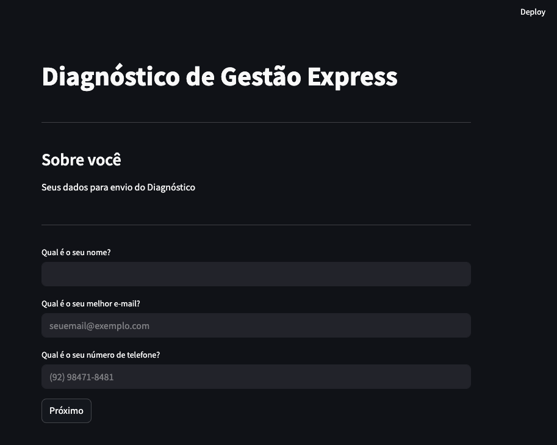

# Diagnóstico de Gestão Express

A Streamlit web application for business owners to assess their management maturity and receive a personalized action plan. The app collects user information, guides them through a short diagnostic, classifies their business phase and management profile, and delivers tailored recommendations via the interface and email.

Streamlit app link: [Diagnostico de gestão Express](https://diagnosticodegestao.streamlit.app/)

---

## 📸 Preview



---

## 🔑 Features

- **User-friendly interface:** Built with [Streamlit](https://streamlit.io/).
- **Step-by-step diagnostic:** Users answer questions about their business phase, management autonomy, and focus.
- **Automatic classification:** The app determines the user's business phase and management profile.
- **Personalized results:** Action plans are shown on-screen and sent by email, with content tailored to the user's answers.
- **Google Sheets integration:** User responses are saved to a Google Spreadsheet.
- **Email notifications:** Both the user and the host receive email notifications with the results.

---

## Requirements

- Python 3.8+
- [Streamlit](https://streamlit.io/)
- [gspread](https://github.com/burnash/gspread)
- [google-api-python-client](https://github.com/googleapis/google-api-python-client)
- [pandas](https://pandas.pydata.org/)
- Email sending dependencies (`smtplib`, `ssl`)

---

## ⚙️ How to Run

### 1️⃣ Create a virtual environment (optional but recommended)

For macOS / Linux:

```bash
python3 -m venv .venv
source .venv/bin/activate
```

For Windows:

```bash
python -m venv .venv
.venv\Scripts\activate
```

---

### 2️⃣ Install dependencies

```bash
pip install -r requirements.txt
```

---

### 3️⃣ **Configure secrets:**

- Create a `.streamlit/secrets.toml` file with your Google API credentials, email credentials, and spreadsheet info:
  ```toml
  gcp_service_account = { ... }
  folder_id = "your-google-drive-folder-id"
  sheet_name = "your-spreadsheet-name"
  spreadsheet_name = "your-worksheet-name"
  EMAIL_HOST = "your-email@gmail.com"
  EMAIL_APP_PASSWORD = "your-app-password"
  ...
  ```

---

### 4️⃣ Run the app

```bash
streamlit run main.py
```

## 🧠 Customization

- **Result templates:** Edit the Markdown files in `page/result/` to change the action plans and messages for each profile and business phase.
- **Email templates:** Email content is generated in `utils.py` and can be customized as needed.

## 📂 Project Structure

```
teste_de_perfil/
├── .venv/                        # (not tracked) Virtual environment files
├── .streamlit/
│   └── secrets.toml              # Streamlit secrets (API keys, credentials, etc.)
├── assets/                       # Static assets (images, logos, screenshots)
├── email/                        # Email templates for personalized results
├── page/                         # Pages, questions and logic
│   └── result/                   # Markdown templates for personalized results
├── classify.py                   # Logic for classifying user answers into categories
├── main.py                       # Main Streamlit app and navigation logic
├── utils.py                      # Utility functions (spreadsheet, email, templates)
├── requirements.txt              # Python dependencies
└── README.md                     # Project documentation (this file)
```

---

_Developed for business diagnostics and management consulting._
